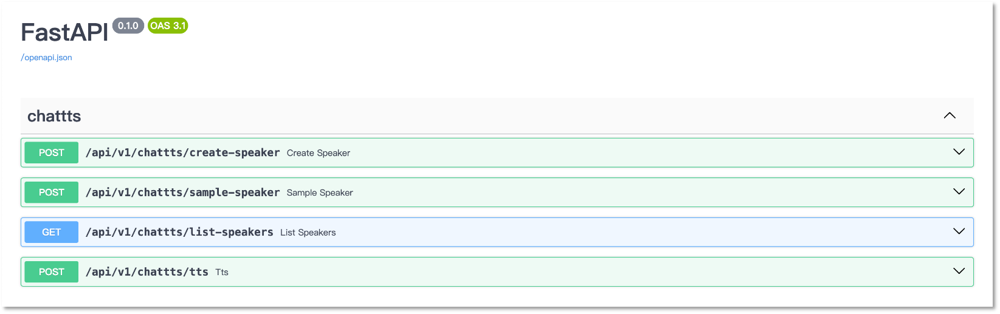

# ChatTTSServer

基于 ChatTTS 的 API 服务。请支持原项目：[ChatTTS](https://github.com/2noise/ChatTTS)。

## 一、快速开始

1. 下载项目：

```shell
git clone https://github.com/IronSpiderMan/ChatTTSServer.git
cd ChatTTSServer
```

2. 如果使用虚拟环境

```shell
conda create --name chattts python=3.10
conda activate chattts
```

3. 安装依赖

```shell
pip install -r requirements.txt
```

4. 运行服务

```shell
uvicorn app.main:app --port 5000 
```

## 二、调用接口

本服务提供了如下接口：



1. create-speaker

上传音色文件及音色名称，创建音色。此音色会存储在 sqlite 数据库中。

```shell
curl -X 'POST' \
  'http://127.0.0.1:5000/api/v1/chattts/create-speaker?name=zack' \
  -H 'accept: application/json' \
  -H 'Content-Type: multipart/form-data' \
  -F 'file=@78fbe7bf08cf41c58c242336021ea535.pth'
```

2. sample-speaker

随机采样一个音色，返回音色文件。

```shell
curl -X 'POST' \
  'http://127.0.0.1:5000/api/v1/chattts/sample-speaker' \
  -H 'accept: application/json' \
  -d ''
```

3. list-speakers

列出所有音色。

```shell
curl -X 'GET' \
  'http://127.0.0.1:5000/api/v1/chattts/list-speakers' \
  -H 'accept: application/json'
```

返回内容：

```json
{
  "data": [
    {
      "name": "zack",
      "id": 1,
      "filepath": "uploads/166c7b4765ff4459abcf3916f089fab4.pth"
    }
  ],
  "count": 1
}
```

4. tts

TTS 接口，传入需要转换的文本和指定音色，如果音色为空，则使用随机音色。返回音频文件。

```shell
curl -X 'POST' \
  'http://127.0.0.1:5000/api/v1/chattts/tts' \
  -H 'accept: application/json' \
  -H 'Content-Type: application/json' \
  -d '{
  "text": "你好啊，我叫野原新之助，今年五岁，最喜欢吃青椒。",
  "speaker": "zack"
}'
```

## 三、构建镜像

在本项目根目录下执行命令：

```shell
docker build -t zacksock/chattts-api .
```

把 `zacksock/chattts-api`修改为你的镜像名字。

然后使用一下命令创建并运行容器：

```shell
docker run -d --name chattts-api -v ./asset:/app/asset -p 8000:8000 -t zacksock/chattts-api
```

如果有NVIDIA GPU，则可以运行：

```shell
docker run -d --gpus '"device=0"' --name chattts-api -v ./asset:/app/asset -p 8000:8000 -t zacksock/chattts-api
```

## 四、Docker Compose

